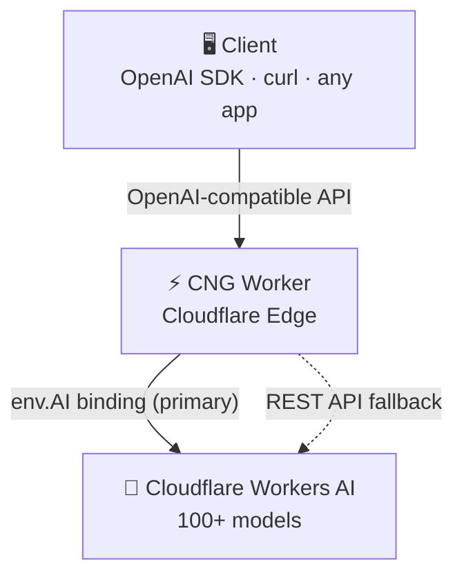

<p align="center">
  
</p>

<h1 align="center">CNG · Cloudflare Neuron Gate</h1>

<p align="center">
  <a href="https://github.com/noizo/cng/actions/workflows/ci.yml"></a>
  <a href="https://github.com/noizo/cng/actions/workflows/codeql.yml"></a>
  <a href="https://github.com/noizo/cng/releases/latest"></a>
  <a href="LICENSE"></a>
  <br>
  <a href="https://developers.cloudflare.com/workers/"></a>
  <a href="https://developers.cloudflare.com/workers-ai/"></a>
  <a href="https://platform.openai.com/docs/api-reference"></a>
  <a href="https://cng-demo.traefik.workers.dev/config"></a>
</p>

OpenAI-compatible API gateway running on Cloudflare Workers AI. Zero dependencies. Instant access to **100+ AI models** — LLMs, image generators, speech, embeddings, and more — behind a standard OpenAI API interface.

**[Live Demo](https://cng-demo.traefik.workers.dev/config)** — password: `cng-public-demo`



## Feature matrix

| Feature | CNG | `openai-cf-workers-ai` | `ai-gateway-wrapper` | `antonai` | CF built-in |
|---|---|---|---|---|---|
| Chat (streaming) | ✅ | ✅ | ✅ | ✅ | ✅ |
| Vision | ✅ | — | — | — | — |
| Tool calls | ✅ | — | — | — | — |
| Reasoning | ✅ | — | — | — | — |
| Image generation | ✅ | ✅ | — | — | — |
| Image editing | ✅ inpainting | — | — | — | — |
| Audio STT | ✅ | ✅ | — | ✅ | — |
| Audio TTS | ✅ | — | — | ✅ | — |
| Embeddings | ✅ | ✅ | — | — | ✅ |
| Translation | ✅ | — | — | — | — |
| Moderation | ✅ | — | — | — | — |

## Platform features

| Feature | CNG | `openai-cf-workers-ai` | `ai-gateway-wrapper` | `antonai` | CF built-in |
|---|---|---|---|---|---|
| Config UI | ✅ built-in | — | — | Chat UI | — |
| Playground | ✅ chat/image/audio | — | — | — | — |
| Model discovery | ✅ live catalog | — | — | — | — |
| Model aliasing | ✅ + spoof | — | — | — | — |
| Model health | ✅ error badges | — | — | — | — |
| Rate limiting | ✅ per-user RPM | — | — | — | — |
| Dynamic users | ✅ admin/client | — | Dummy key | — | — |
| SSO | ✅ CF Access | — | — | — | — |
| Cost tracking | ✅ real-time | — | AI Gateway | — | — |
| KV persistence | ✅ optional | — | — | ✅ | — |
| REST API fallback | ✅ auto | — | — | — | — |
| Zero dependencies | ✅ | — | — | — | — |
| Single-file deploy | ✅ | — | — | — | — |

## Quick start

### Option A: One-click deploy

[](https://deploy.workers.cloudflare.com/?url=https://github.com/noizo/cng)

Forks the repo and deploys to your Cloudflare account. The deploy page prompts for `CF_ACCOUNT_ID`, `CF_API_TOKEN`, and `API_KEY` — fill them in and click **Create and deploy**. For `API_KEY`, generate a random string:

```bash
openssl rand -base64 32 | tr '+/' '-_' | tr -d '='
```

Save the generated key — you'll need it to access the config panel.

### Option B: One-liner install

No clone needed — downloads the latest bundle and deploys interactively:

```bash
curl -fsSL https://raw.githubusercontent.com/noizo/cng/main/setup.sh | bash
```

### Option C: Clone + setup script

```bash
git clone https://github.com/noizo/cng.git
cd cng
./setup.sh
```

Both use the same script. From a clone it deploys from source; via `curl` it downloads the pre-built bundle. The script generates an admin key, walks you through account ID, API token, optional KV, and starter model catalog.

**Prerequisites:** [Node.js](https://nodejs.org/) and [Wrangler](https://developers.cloudflare.com/workers/wrangler/install-and-update/)

```bash
npm install -g wrangler
wrangler login
```

### Option D: Manual (wrangler)

```bash
# 1. Edit wrangler.toml — set worker name
#    Optionally uncomment the KV section for persistent config

# 2. Deploy
wrangler deploy

# 3. Set secrets — API_KEY is the admin key (full access)
echo "<your-cloudflare-account-id>" | wrangler secret put CF_ACCOUNT_ID
echo "<your-cloudflare-api-token>"  | wrangler secret put CF_API_TOKEN
echo "$(openssl rand -base64 32 | tr '+/' '-_' | tr -d '=')" | wrangler secret put API_KEY

# 4. (Optional) Client key — inference only, no config access
echo "$(openssl rand -base64 32 | tr '+/' '-_' | tr -d '=')" | wrangler secret put API_KEY_2
```

### Option E: Terraform (infrastructure-as-code)

For teams or reproducible deployments. Complete Terraform configuration with worker, KV, custom domain, and SSO is in [`examples/terraform/`](examples/terraform/).

## Secrets & environment

| Secret | Required | Description |
|---|---|---|
| `CF_ACCOUNT_ID` | ✅ | Your Cloudflare account ID — find it on the [dashboard overview](https://dash.cloudflare.com/) (right sidebar) |
| `CF_API_TOKEN` | ✅ | API token — needed for model discovery, analytics, and REST API fallback. See [how to create one](#creating-the-api-token) |
| `API_KEY` | ✅ | Admin key for the gateway. Auto-generated by `setup.sh`, or create your own (see [generating API_KEY](#generating-api_key)) |
| `API_KEY_2` | — | Optional client key — inference only, no config access |
| `GATEWAY_CONFIG` | — | JSON config string — persists settings on free tier without KV (see [below](#persisting-config-on-free-tier)) |

| Binding | Required | Description |
|---|---|---|
| `AI` (Workers AI) | ✅ | Native Workers AI binding — primary inference path. Configured automatically via `wrangler.toml` |
| `CONFIG` (KV) | — | KV namespace for persistent config and dynamic users. Without it, config is in-memory (resets on cold start) and only env keys work |

### How keys work

CNG needs **three required secrets** to operate:

- **`CF_ACCOUNT_ID`** + **`CF_API_TOKEN`** are your Cloudflare credentials. Even though the `AI` binding handles inference directly, the token is still required for model discovery (the "Add model" panel), usage analytics (`/api/status`), and as an automatic fallback if the AI binding is ever unavailable. **Without these, you cannot add or manage models.**
- **`API_KEY`** is the admin gateway key. This is **not** a Cloudflare token — it's a random secret that protects your CNG instance. Anyone with this key has full access to config, model management, and inference. The `setup.sh` script generates one automatically, or you can create your own.
- **`API_KEY_2`** is an optional client key. It can only call inference endpoints (`/v1/chat/completions`, `/v1/images/generations`, etc.) and view models. Admin routes return `403 Forbidden`.
- **KV users** created through the config panel are always client role.

### Creating the API token

`CF_API_TOKEN` is a [Cloudflare API Token](https://dash.cloudflare.com/profile/api-tokens) that gives CNG access to model discovery, usage analytics, and the REST API fallback.

#### Minimum required scopes

| Scope | Category | Permission | Used by |
|---|---|---|---|
| Workers AI | Account | Read + Edit | Model discovery (`/api/discover`), REST API inference fallback |
| Account Analytics | Account | Read | Neuron usage, cost projections, worker invocation stats (`/api/status`) |
| Workers KV Storage | Account | Edit | Persistent config and dynamic users *(only if using KV)* |

Without **Workers AI** permissions, the "Add model" panel and REST API fallback will not work.
Without **Account Analytics**, the status dashboard will show zeros.

#### Step-by-step

1. Go to [**Cloudflare API Tokens**](https://dash.cloudflare.com/profile/api-tokens)
2. Click **Create Token** → **Create Custom Token**
3. Add the permissions listed above
4. **Account Resources** → select your specific account (or "All accounts")
5. Click **Continue to summary** → **Create Token**
6. Copy the token and set it:

```bash
echo "<your-token>" | wrangler secret put CF_API_TOKEN
```

> **Tip:** Cloudflare also offers a quick template — on the Workers AI page, click "Use REST API" → "Create a Workers AI API Token". This pre-fills Workers AI Read + Edit, but you still need to add Account Analytics Read manually.

### Generating API_KEY

`API_KEY` is a random secret that protects your gateway. It's **not** related to Cloudflare — you generate it yourself.

**Automatic** (recommended) — `setup.sh` and `install.sh` generate one for you during setup.

**Manual:**

```bash
openssl rand -base64 32 | tr '+/' '-_' | tr -d '=' | wrangler secret put API_KEY
```

This generates a secure random key and sets it as a worker secret in one command. Save the output — you'll need it to access the config panel and make API calls.

## Usage

### Base URL

```
https://<worker-name>.<subdomain>.workers.dev/v1
```

Or your custom domain if configured.

### Authentication

```
Authorization: Bearer <your-api-key>
```

### Endpoints

| Method | Path | Auth | Admin | Description |
|---|---|---|---|---|
| `POST` | `/v1/chat/completions` | ✅ | — | Chat completions (streaming supported) |
| `POST` | `/v1/images/generations` | ✅ | — | Image generation |
| `POST` | `/v1/images/edits` | ✅ | — | Image inpainting (multipart) |
| `POST` | `/v1/embeddings` | ✅ | — | Text embeddings |
| `POST` | `/v1/audio/transcriptions` | ✅ | — | Speech-to-text (multipart) |
| `POST` | `/v1/audio/translations` | ✅ | — | Audio translation (multipart) |
| `POST` | `/v1/audio/speech` | ✅ | — | Text-to-speech |
| `POST` | `/v1/translations` | ✅ | — | Text translation |
| `POST` | `/v1/moderations` | ✅ | — | Content moderation |
| `GET` | `/v1/models` | ✅ | — | List available models |
| `GET` | `/api/status` | ✅ | — | Live status + costs (JSON) |
| `GET` | `/config` | — | — | Web config panel |
| `GET` | `/img/{id}` | — | — | Cached generated images |
| `GET` | `/api/config` | ✅ | ✅ | Current config (JSON) |
| `POST` | `/api/config` | ✅ | ✅ | Save config |
| `GET` | `/api/discover` | ✅ | ✅ | Browse Cloudflare model catalog |
| `GET` | `/api/users` | ✅ | ✅ | API key management |
| `POST` | `/api/users` | ✅ | ✅ | User CRUD (requires KV) |

### Examples

**Chat:**

```bash
curl https://your-worker.workers.dev/v1/chat/completions \
  -H "Authorization: Bearer $KEY" \
  -H "Content-Type: application/json" \
  -d '{"model": "gpt-4o", "messages": [{"role": "user", "content": "Hello"}]}'
```

**Image generation:**

```bash
curl https://your-worker.workers.dev/v1/images/generations \
  -H "Authorization: Bearer $KEY" \
  -H "Content-Type: application/json" \
  -d '{"model": "dall-e-3", "prompt": "A mountain at sunset", "size": "1920x1080"}'
```

**Transcription:**

```bash
curl https://your-worker.workers.dev/v1/audio/transcriptions \
  -H "Authorization: Bearer $KEY" \
  -F file=@audio.mp3 \
  -F model=whisper-1
```

**Text-to-speech:**

```bash
curl https://your-worker.workers.dev/v1/audio/speech \
  -H "Authorization: Bearer $KEY" \
  -H "Content-Type: application/json" \
  -d '{"model": "tts-1", "input": "Hello world"}' \
  --output speech.mp3
```

**Status:**

```bash
curl -H "Authorization: Bearer $KEY" https://your-worker.workers.dev/api/status | jq
```

## Access control

CNG uses role-based access control with two roles:

| Role | Source | Can do |
|---|---|---|
| `admin` | `API_KEY` env secret | All inference + config management + user CRUD |
| `client` | `API_KEY_2` env secret, KV-created users | Inference + model list + status only |

Admin routes (`/api/config`, `/api/discover`, `/api/users`) return `403 Forbidden` for client keys.

Dynamic user management (create/delete via `/api/users`) requires the KV `CONFIG` binding. Without KV, only the two env keys are available.

## Models

CNG does not hardcode a fixed model list. Models are managed entirely through the **config panel** — add, remove, and reorder any model from the Cloudflare Workers AI catalog.

### How it works

1. Open the config panel at `/config`
2. Click **+ Add** under any category (Chat, Image, Voice, Utility)
3. A discovery modal queries the [Cloudflare Workers AI catalog](https://developers.cloudflare.com/workers-ai/models/) in real-time
4. Browse, search, and toggle models on/off — complete with capability badges, pricing, and context window info
5. Changes auto-save (with KV) or can be exported as JSON

The gateway ships with a sensible default set, but you can replace it entirely with whatever models Cloudflare offers — no code changes, no redeployment.

### Model categories

| Category | Endpoint | Examples |
|---|---|---|
| Chat | `/v1/chat/completions` | Qwen, GLM, Llama, GPT-OSS, Kimi, DeepSeek |
| Image | `/v1/images/generations` | Flux 1/2, SDXL Lightning, Leonardo Phoenix, Dreamshaper |
| Voice | `/v1/audio/*` | Whisper (STT), Deepgram Aura (TTS), MeloTTS |
| Utility | `/v1/embeddings`, `/v1/moderations`, `/v1/translations` | BGE (embeddings), Llama Guard (moderation), M2M100 (translation) |

## Alias spoofing

Aliases map familiar names (like `gpt-4o`) to real Cloudflare models. Aliases always resolve for every API key — if a client sends `"model": "gpt-4o"`, the gateway routes it to the mapped backend regardless of spoof mode.

**Spoof mode** controls what `/v1/models` returns for a given API key:

| Spoof aliases | `/v1/models` returns | Use case |
|---|---|---|
| OFF (default) | Real Cloudflare model IDs | Direct usage, development, transparency |
| ON | Only alias names — real models hidden | Drop-in OpenAI replacement for clients that expect OpenAI model names |

### Why spoof?

Many OpenAI-compatible clients (chat UIs, plugins, automation tools) query `/v1/models` to populate their model selector. If they see unfamiliar names like `qwen3-30b-a3b-fp8`, they either:
- Don't display them (hard-coded OpenAI model lists)
- Show confusing names to end users
- Fail validation checks

With spoof ON, the client sees `gpt-4o`, `dall-e-3`, `whisper-1` — names it expects. The gateway transparently routes these to the configured Cloudflare backends.

### Per-key control

Spoof is toggled per API key in the config panel. This lets you run mixed setups:
- **Key A (spoof ON)** — used by a chat UI that expects OpenAI names
- **Key B (spoof OFF)** — used by scripts or direct API calls that use real model IDs

Both keys can use aliases in their requests regardless of the spoof setting.

## Config panel

Access at `https://your-worker/config` — protected by SSO (see below) or `?key=<your-api-key>`.

Your API key is stored in `localStorage` and persists across browser sessions. To log out, click the browser DevTools console and run `localStorage.removeItem("cng_key")`, or clear site data.

The panel is served directly by the worker — no external dependencies. It provides:

- **Models** — four columns (Chat, Image, Voice, Utility) with scrollable lists, reorder, and per-category discovery from the Cloudflare catalog
- **Config** — API keys with inline renaming, per-key spoof toggle, and aliases with target model selectors
- **Live Status** — real-time neuron usage, cost projections, auto-refresh
- **API Reference** — inline endpoint docs and spoof mode explanation
- **Export JSON** — download current config for backup or wrangler import

### With vs without KV

| Feature | Free tier (no KV) | Paid ($5/mo with KV) |
|---|---|---|
| Gateway routing | ✅ | ✅ |
| Config panel | ✅ | ✅ |
| Config changes | Via `GATEWAY_CONFIG` secret | Persistent in KV |
| Dynamic users | Via JSON export/import ([see below](#adding-users-without-kv)) | Create/delete via panel |
| Export JSON | ✅ | ✅ |

### Persisting config on free tier

Without KV, config lives in memory and resets on cold start. To persist your settings:

1. Configure everything in the config panel
2. Click **Export JSON** to download your config
3. Save it as a worker secret:

```bash
wrangler secret put GATEWAY_CONFIG < cng-config.json
```

The worker loads `GATEWAY_CONFIG` on startup and merges it with defaults. Repeat these steps whenever you change settings.

KV users don't need this — their config persists automatically. Export JSON is just a backup for KV users.

### Adding users without KV

Without KV, you can't create users from the config panel. Instead, generate a key, hash it, and add the user to your exported config JSON:

```bash
# 1. Generate a key for the new user
KEY=$(openssl rand -base64 32 | tr '+/' '-_' | tr -d '=')
echo "New user key: $KEY"

# 2. Compute the SHA-256 hash
HASH=$(printf '%s' "$KEY" | shasum -a 256 | cut -d' ' -f1)

# 3. Add to your config JSON (cng-config.json)
#    Insert into the "users" array:
#    { "id": "bob", "keyHash": "<hash>", "role": "client", "created": "2026-03-31" }
```

Your `cng-config.json` should have a `users` array:

```json
{
  "users": [
    { "id": "bob", "keyHash": "a1b2c3...", "role": "client", "created": "2026-03-31" }
  ],
  "chatModels": [ ... ]
}
```

Then apply it:

```bash
wrangler secret put GATEWAY_CONFIG < cng-config.json
```

The user can now authenticate with `Authorization: Bearer <KEY>`. Repeat for additional users — each needs a unique `id` and `keyHash`.

## SSO (Cloudflare Access + GitHub)

Optionally protect the config panel with GitHub SSO via Cloudflare Zero Trust Access. This adds a login gate before the panel — no code changes to the worker.

### Prerequisites

1. **Create a GitHub OAuth App** at [github.com/settings/developers](https://github.com/settings/developers):
   - **Homepage URL:** `https://your-worker-domain/config`
   - **Authorization callback URL:** `https://<your-team-name>.cloudflareaccess.com/cdn-cgi/access/callback`
   - Note the **Client ID** and **Client Secret**

2. **Find your team name** — this is the subdomain you chose when setting up Cloudflare Zero Trust (visible at Zero Trust → Settings → Custom Pages). If you haven't enabled Zero Trust yet, go to the [Zero Trust dashboard](https://one.dash.cloudflare.com/) and complete the onboarding — it will ask you to pick a team name.

### Manual setup (dashboard)

1. Go to **Zero Trust → Settings → Authentication → Login methods**
2. Click **Add new** → **GitHub**
3. Enter the **Client ID** and **Client Secret** from step 1
4. Save

Then create the access application:

1. Go to **Zero Trust → Access → Applications**
2. Click **Add an application** → **Self-hosted**
3. Set the **Application domain** to `your-worker-domain` and **Path** to `/config`
4. Set **Session Duration** to 24 hours
5. Under **Identity providers**, select the GitHub provider you just added
6. Enable **Auto-redirect to identity** (skip the provider picker when there's only one)
7. Under **Policies**, add a policy:
   - **Name:** Allow admin
   - **Action:** Allow
   - **Include:** Emails — enter your GitHub email(s)
8. Save

Visiting `/config` now redirects to GitHub login. After auth, Cloudflare sets a 24h session cookie.

### Terraform setup

The same SSO configuration is available as Terraform in [`examples/terraform/sso.tf`](examples/terraform/sso.tf) — set `enable_sso = true` and provide your OAuth credentials.

### What gets protected

| Path | Auth |
|---|---|
| `/config` | SSO (GitHub login via Cloudflare Access) |
| `/v1/*`, `/api/*` | Bearer token (unchanged) |
| `/img/*` | Unauthenticated (ephemeral UUIDs, 1h cache) |

The panel still uses your API key internally for `/api/*` calls — SSO handles who can access the page, the Bearer token handles what the page can do.

## OpenAI SDK compatibility

Works with any OpenAI-compatible client:

```python
from openai import OpenAI

client = OpenAI(
    base_url="https://your-worker.workers.dev/v1",
    api_key="your-api-key",
)

response = client.chat.completions.create(
    model="gpt-4o",
    messages=[{"role": "user", "content": "Hello!"}],
)
print(response.choices[0].message.content)
```

```typescript
import OpenAI from 'openai';

const client = new OpenAI({
  baseURL: 'https://your-worker.workers.dev/v1',
  apiKey: 'your-api-key',
});

const response = await client.chat.completions.create({
  model: 'gpt-4o',
  messages: [{ role: 'user', content: 'Hello!' }],
});
```

With spoof OFF, use real model IDs instead of aliases.

## Costs

Cloudflare Workers AI uses **neurons** as the billing unit.

| Tier | Included | Overage |
|---|---|---|
| Free | 10,000 neurons/day | — |
| Paid ($5/mo) | 10,000 neurons/day | $0.011 per 1,000 neurons |

The `/api/status` endpoint and config panel show real-time neuron usage and cost projections.

## Resetting the admin password

The admin "password" is the `API_KEY` secret bound to the worker. To reset it:

```bash
openssl rand -base64 32 | tr '+/' '-_' | tr -d '=' | wrangler secret put API_KEY
```

After resetting, clear the old key from your browser — open DevTools console and run `localStorage.removeItem("cng_key")`, then visit `/config` and enter the new key.

## Development

```bash
npm test          # Run all tests (node:test, zero deps)
npm run bundle    # Build single-file bundle → dist/cng.js
npm run deploy:dry # Dry-run deploy (verify bundle)
npm run deploy    # Deploy to Cloudflare
```

## Disclaimer

This project was created for personal use. The author assumes no responsibility for any financial loss, unexpected charges, or damages arising from the use of this software. Use at your own risk.

## Contributing

All contributions are welcome — bug reports, feature requests, pull requests. Feel free to open an issue or submit a PR.

## Similar projects

| Project | Stars | License |
|---|---|---|
| [`openai-cf-workers-ai`](https://github.com/chand1012/openai-cf-workers-ai) | 279 | MIT |
| [`ai-gateway-openai-wrapper`](https://github.com/pokon548/ai-gateway-openai-wrapper) | 143 | AGPL-3.0 |
| [`antonai`](https://github.com/akazwz/antonai) | 110 | MIT |
| [CF built-in](https://developers.cloudflare.com/workers-ai/configuration/open-ai-compatibility) | — | — |


## License

Apache-2.0
